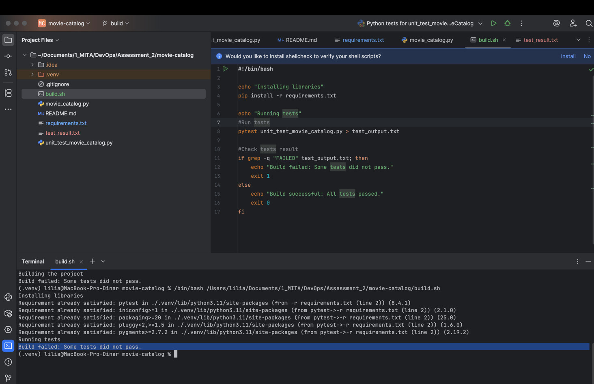

# movie-catalog

This is a movie catalog application.

Features:
1. Add movie to catalog
2. Get all movies in catalog
3. Get movies by genre

Project has 5 unit-tests, three of them are passed, two are failed.
Because of 2 fail tests the build won't be successful.

Build automation result:
